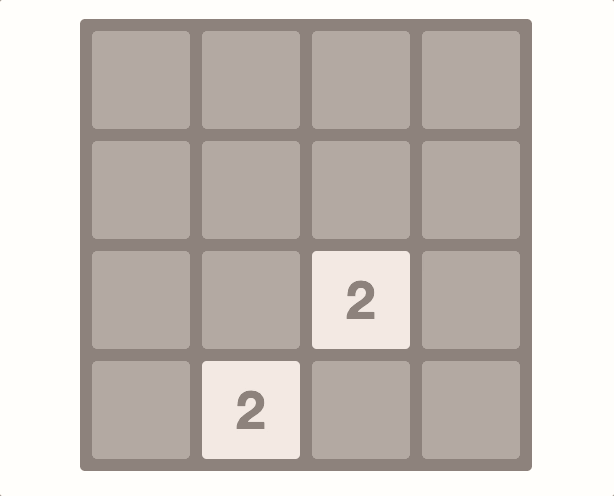

# 2048 game (https://arsenic14.github.io/game2048/)

Implementation of the popular mobile game 2048 in React.js

## Technologies

* [React](https://reactjs.org) - A JavaScript library for building user interfaces
* [Webpack](https://webpack.js.org/) - App builder
* [Babel](https://babeljs.io/) - JS compiler
* [Yarn](https://yarnpkg.com/) - Package dependency Management
* [ESLint](https://eslint.org/) - App linter
* [Prettier](https://prettier.io/) - Code formatter
* [Styled components](https://styled-components.com/) - Visual primitives for the component age
* [Rotate matrix](https://github.com/miguelmota/rotate-matrix) - Simple library for rotate matrix
* [uniqid](https://github.com/adamhalasz/uniqid/) - A Unique Hexatridecimal ID generator

